# ¿Mayor o Menor? (Scaloneta) 🇦🇷⚽
### Proyecto Interdisciplinario - 1er Cuatrimestre

Este proyecto consiste en el desarrollo de una aplicación web interactiva basada en el clásico juego *Higher or Lower* (Mayor o Menor), enfocado exclusivamente en los futbolistas que formaron parte de la Selección Argentina durante el ciclo de conducción técnica de Lionel Scaloni.

---

##  Integrantes (Grupo 17 - División B)
* **Hilario Enrique Reddel**
* **Tomas Miranda**
* **Lucas Joaquín Fabiani Nucaro**
* **Facundo Tomás Poet Kleisinger**

---

##  Descripción de la Propuesta
El juego desafía a los usuarios a adivinar y comparar estadísticas (goles o partidos jugados) de los jugadores de la Scaloneta:

* **Mecánica Inicial:** Al comenzar, se presentan dos jugadores en pantalla. Se revela la cantidad exacta de partidos o goles del primer jugador (izquierda).
* **Dinámica de Juego:** El usuario debe elegir si el jugador de la derecha tiene **más** o **menos** partidos/goles que el de la izquierda.
* **Aciertos:** Si el usuario acierta, suma **+1 punto**. El jugador de la derecha se desplaza hacia la izquierda y aparece un nuevo futbolista en el lado derecho para continuar la racha.
* **Fin de la Partida:** Si el usuario falla, el contador se detiene. La app muestra el puntaje final obtenido y el récord histórico de puntos guardado.

> **Fuentes de referencia de datos:**
> * [Presencias en la Selección Argentina (Futfactos)](https://www.futfactos.com/argentina/un-jugador/hol-presencias)
> * [Goles en la Selección Argentina (Futfactos)](https://www.futfactos.com/argentina/un-jugador/hol-goles)

---

##  Alcance y Objetivos
* Desarrollar un juego web tipo *Higher or Lower* centrado en la Selección Argentina.
* Permitir la comparación dinámica de estadísticas de dos jugadores en tiempo real.
* Soportar partidas extensibles según la capacidad del usuario, con un límite máximo teórico de 86 jugadores.
* Calcular de forma automática el puntaje acumulado en base a las respuestas correctas.
* Implementar una base de datos persistente para almacenar los registros de jugadores, estadísticas y perfiles de usuarios.
* Disponer de una pantalla final con el resumen de la partida y un **Ranking Global** con los mejores puntajes del sistema.

---

##  Modelo de la Base de Datos
El sistema almacena la información mediante una estructura relacional compuesta por tres tablas principales encargadas de gestionar los jugadores, el historial de partidas y las credenciales de los usuarios:

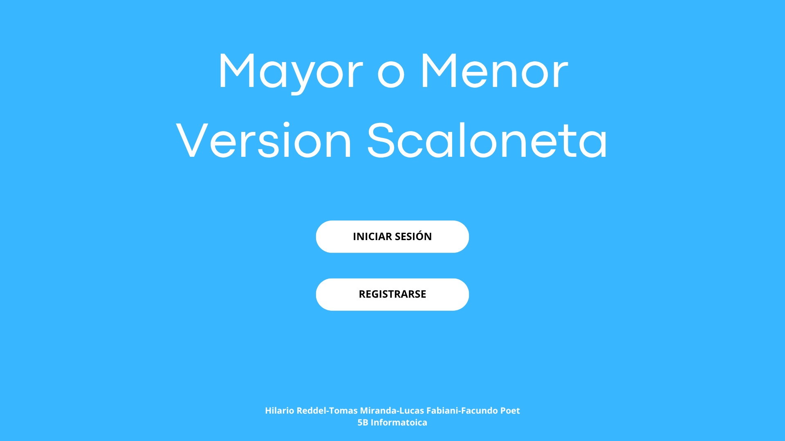
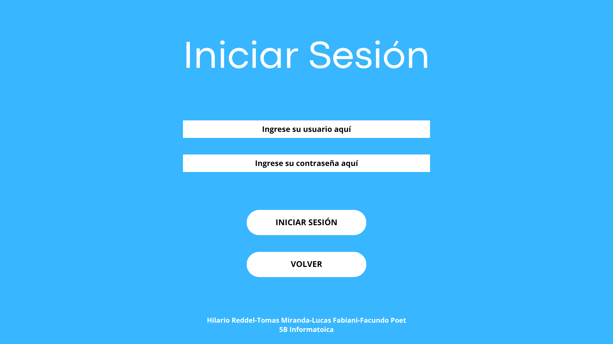
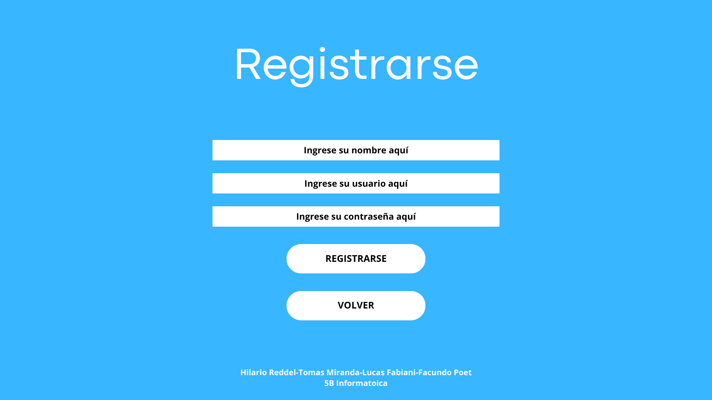
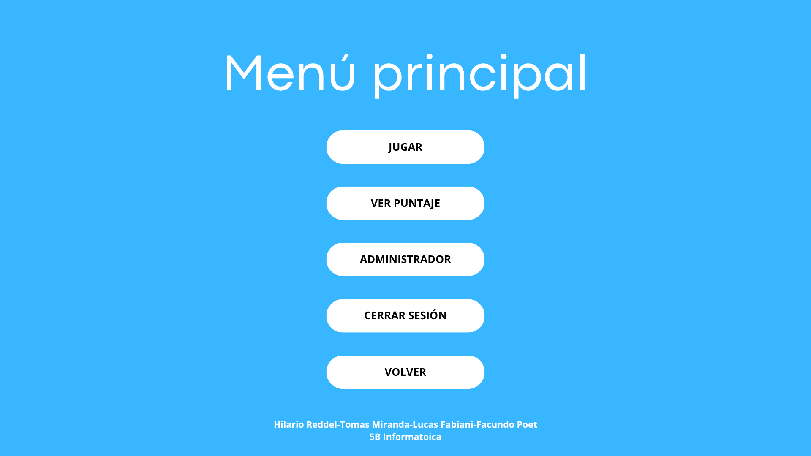
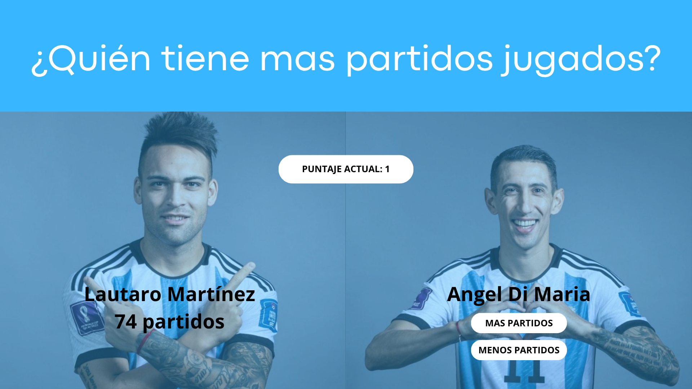
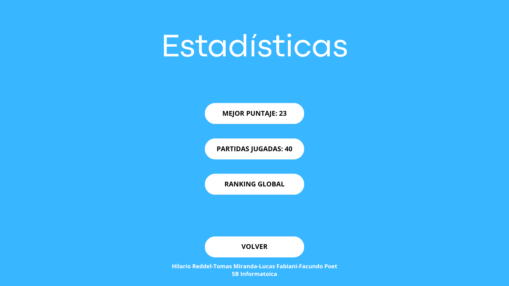
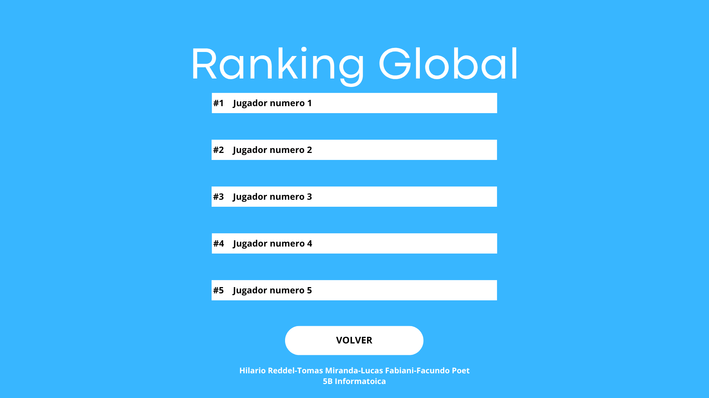
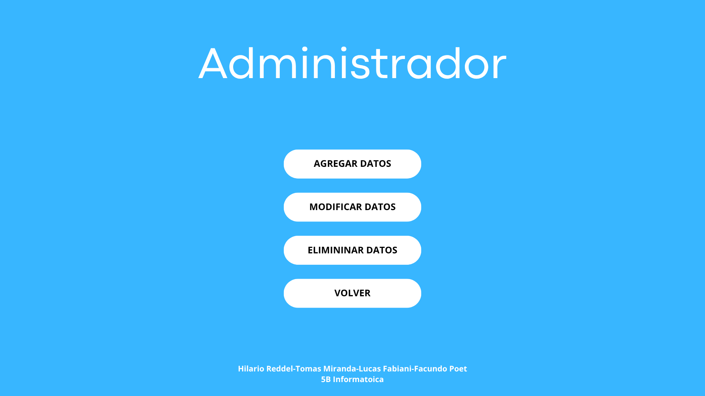
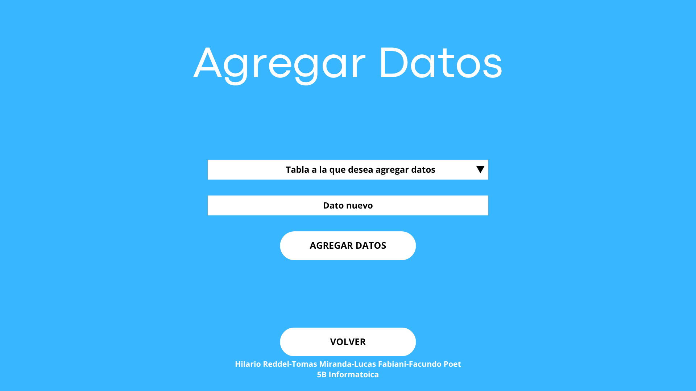
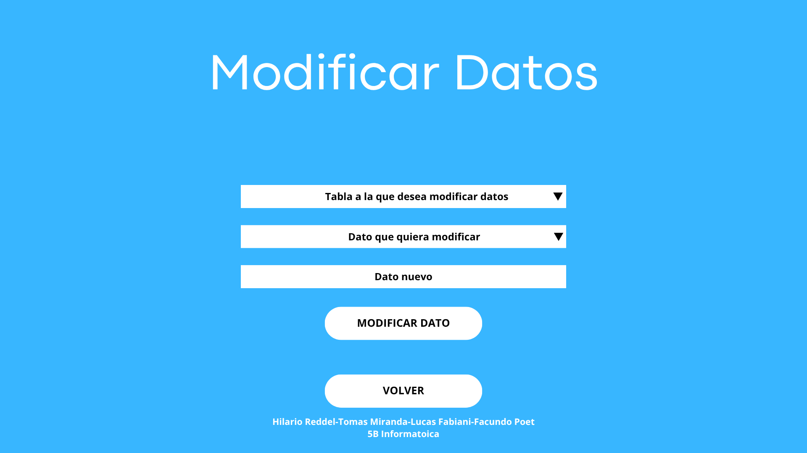
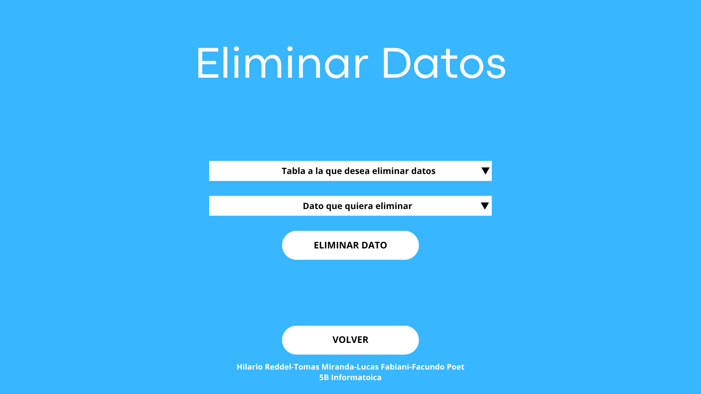
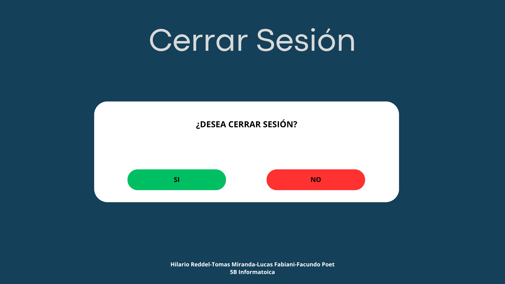